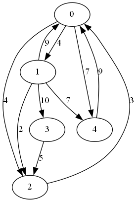
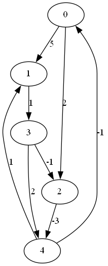
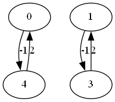
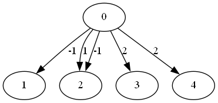
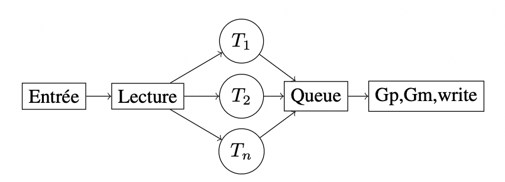

# Introduction
As part of this project, we were asked, initially, to translate a Python code into C that applies the Bellman-Ford algorithm in a single-threaded manner to a graph whose information is stored in a file. In a second step, we had to implement this code in a multi-threaded fashion, optimizing memory consumption and execution time.

# Running the Program
To compile the project, enter the following command:

```sh
make
```

The executable is generated in the root folder. Then execute the program:

```sh
./main [-v verbose] [-n nb_threads] [-f output_file] input_file
```

The arguments in square brackets are optional.

- *verbose* (bool): Displays debug messages.
- *nb_threads* (uint8_t): Number of threads executing the Bellman-Ford algorithm. The default number of threads is set to four.
- *output_file* (binary file): Output file. If no output file is specified, the results are displayed in text format in the console.
- *input_file* (binary file): File containing information about the graph.

To clean the project by deleting the executables and files created during compilation, simply enter:

```sh
make clean
```

# Tests
### Running Tests
To launch unit tests, make sure you have Cunit installed, then enter the following command:

```sh
make tests
```

Next, if you want to check for memory leaks:

```sh
make valgrind
```

Finally, to test the code with cppcheck:

```sh
make cpp
```

### Test Graphs

We created four graphs gathered in the `tests/graph` folder.
- `normal_graph`

   

- `negative_cycle_graph`: checks what happens when a negative cycle is present in the graph.

  

- `non_connected_graph`: checks what happens when the graph is non-connected.

  

- `all_links_start_from_node_0`: checks two elements:
    - When there are two edges starting from the same source node and ending at the same destination node, the one with the lowest cost is chosen by the bellman_ford function.
    - When two nodes have an equally short path with the cost corresponding to the cost of the longest shortest path, the get_max function chooses the path with the destination node having the lowest index (in this case, nodes 3 and 4 have the same minimal cost, but node 3 is chosen).

    

# Project Structure
| Folder  | Description |
|:--------:|:-----------:|
| `src`    | Project source code |
| `tests`  | Test source files |
| `include`| Headers |

| File | Description |
|:-------:|:-----------:|
| `file.c`|File handling. Contains read_graph, write_file, and show functions.|
|`graph.c`| Contains bellman-ford, get_path, and get_max functions. |
| `sp.c`  |Contains the main function, coordinating other functions.|
| `thr.c` | Directs execution in a multi-threaded manner. |
|`tests.c`| Main test file. |

# Use of Structures
To facilitate the implementation of our functions, we created structures corresponding to each of them. The definitions of these structures are in the include/include_and_struct.h file.

# Multi-threading
We used a producer-consumer model with a linked data structure of the queue type.

Two semaphores are used to link the producer and the consumer. The first makes the consumer wait until there is an element in the queue, and the second limits the size of the queue.

The *producer* threads execute the Bellman-Ford algorithm from each source node, store this result in a node, and place it in the queue.

The *consumer* thread removes a node from the queue, applies the get_path and get_max functions to the content of the node, and writes the results to the output file.

Mutexes are used to handle errors, ensure that all source nodes are processed only once, prevent conflicts when adding and taking nodes from the queue, and prevent nodes from interleaving during output file writing.



# Group Members
- Aydin Matya 37592100
- Dallemagne Brieuc 77122100
- Lebras Floriane 35022100
- Mounir Samy 46422100
- Van Hees Charles 35562100
- Verschuere Louise 33772100
